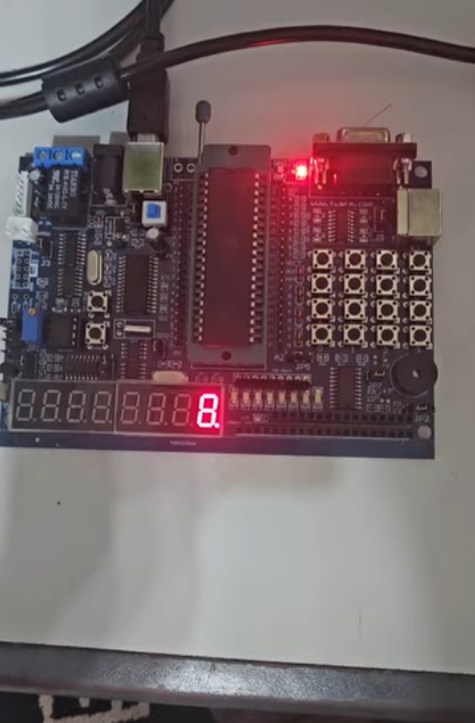
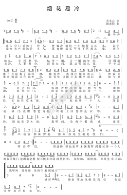
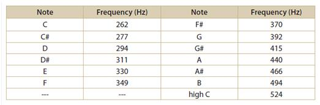

# 8051 Music Player - 周杰倫《煙花易冷》

使用 8051 單晶片以 **雙 Timer 中斷**播放周杰倫《煙花易冷》。  
- **Timer0**：控制每個音符的「拍長」（本專題設定 **每拍 0.625 秒**）  
- **Timer1**：產生音符頻率（以中斷翻轉輸出腳形成方波）  
- 支援 **休止符**

> 開發環境：SDCC + Makefile

---

### 完整 Demo 影片（YouTube）
[Watch on YouTube Shorts](https://youtube.com/shorts/CT0v7uAuHbU)

<a href="https://youtube.com/shorts/CT0v7uAuHbU">
  
</a>

---

<details>
<summary>Score (簡譜) & Note Frequency Table (click to expand)</summary>

### Score (簡譜)


### Note Frequency Table

</details>


---

## Hardware
- 8051 (AT89S52)
- 晶振：**12 MHz**（本專案的 Timer 參數以 12MHz 計算）
- 被動蜂鳴器 / 小喇叭
- 輸出腳位：**P3.4**

---

## How it works (雙 Timer 分工)

### Timer0：拍長控制
- Timer0 設成 Mode 1 (16-bit)
- 以 12MHz 時鐘下，每次 overflow 設為 **0.025s (25ms)**
- 累計 **25 次 = 0.625s = 1 拍**

### Timer1：音高（頻率）輸出
- Timer1 設成 Mode 1 (16-bit)
- Timer1 overflow 觸發中斷時翻轉 P3.4
- 音高由 `note[]` 提供 reload 值（已預先算好）

方波頻率近似：
`f ≈ (Fosc/12) / (2 * (65536 - reload))`

---

## Score encoding (樂譜資料 sheet[])
`sheet[]` 為播放序列，主要使用：
- `0`：休止符（不發聲）
- `1~14`：對應 `note[]` 的音高索引（用 Timer1 產生頻率）
- `15 / 16 / 17`：用來指定下一個音符的固定幾種時值（例如：約半拍/更短/約兩拍），透過 Timer0 的 time_count 累計規則實作。

> 實際播放內容請直接以 `sheet[]` 與 `note[]` 為準。

---

## 編譯方式（Build / Compile）

### 需求
- SDCC
- make
- packihx（通常 SDCC 會附）

### 編譯
在專案根目錄下：
```bash
cd src
make
```

輸出檔：
- `main.hex`（燒錄用）

### 清理（clean）
```bash
cd src
make clean
```

> 注意：`make clean` 在 Windows 可用（使用 `del`）。  
> 若在 Linux/macOS，請把 `src/Makefile` 的 `del` 改成 `rm -f`。

---

## 專案架構（Project Structure）

```
8051-MusicPlayer/
│
├─ README.md                 # 專案說明：Demo 連結、硬體需求、雙 Timer 原理、編譯方式
├─ .gitignore                # 忽略編譯產物（.ihx/.hex/.rel/.lst...），讓 repo 乾淨
│
├─ src/                      # 程式碼與編譯入口（在此資料夾下執行 make）
│  ├─ Makefile               # 使用 SDCC 編譯 main.c，並輸出 main.hex（燒錄用）
│  └─ main.c                 # 8051 主程式：Timer0 控拍長、Timer1 產生頻率、P3.4 輸出蜂鳴器
│
└─ assets/                   # README 使用的圖片資源
   ├─ youtube_thumb.png      # YouTube demo 縮圖（README 點擊可跳轉影片）
   ├─ score.png              # 《煙花易冷》簡譜截圖（對照 sheet[] 播放序列）
   └─ notes_table.png        # 音符頻率表（C/D/E... 對應頻率，方便理解 note[] 設定）
```
